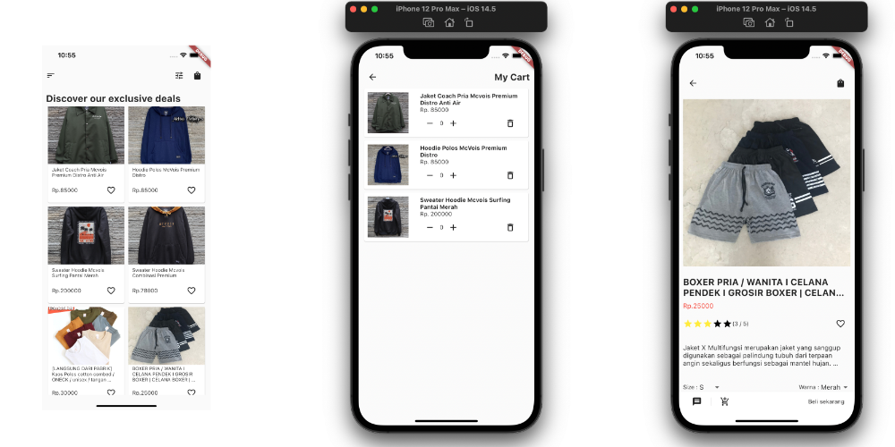

### MyShop - mock up shop app

---

Simple mock up ( currently ) without logic, just simple

### Written in

---

<ul>
    <li>
        Flutter 2.2.3
    </li>
    <li>
         Dart 2.13.4
    </li>
    <li>
         Uvicorn 0.15.0
    </li>
    <li>
        Fastapi 0.1.0
    </li>
</ul>

### Setup

---

To run this project locally, do :

1. [Install flutter](https://flutter.dev/docs/get-started/install)
2. [Install fastAPI and Uvicorn](https://fastapi.tiangolo.com/)
3. Run server with uvicorn => `uvicorn main:app --reload`
4. Connect or open your selected emulator devices
5. Run flutter apps => `flutter run`

### Documentation

---

#### Future work

---

###### To do

1. Seperate logic in cart
2. Add more example data for scaling up
3. add rating data in database
4. is like button per data
5. tema warna aplikasi
6. clean code
7. sliver appbar
8. settings menu
9. adaptive screen size
10. layoutbuilder every screen

##### on going

1. shopping cart page with listviewbuilder

###### v1.1 update

1. add read more section on description
2. add fastAPI to source
3. read more comment

##### source

---

This app inspired is inspired by this [mock up](https://dribbble.com/shots/15706627-Ecommerce-App/attachments/7506209?mode=media).
